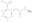

# Creating CxSMILES

This chapter covers the following use case: experiment data has provided
a short list of possible chemical structures, for example, resulting from
a database search on <topic>molecular formula</topic> or <topic>m/z value</topic>. Often, the top hits
of <topic>posititional isomers</topic>, and the wish exists to convert these isomers
into a Markush structure and represented as CxSMILES.

## Maximal Common Substructure

One step in converting a short list of chemical structures into a CxSMILES
that represents them is determination of the <topic>maximal common substructure</topic>
or <topic>MCS</topic>. The code for this would look like this:

<code>MCS</code>

For the two given input structures, it finds one overlap:

<out>MCS</out>

The resulting MCS can be mapped back to the input structure, and colored
accordingly:

<code>APs</code>

We can then see the common structure in the SMILES, here for the first SMILES
from the MCS example:

## SDF in, CxSMILES out

## References

<references/>

