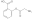

# Creating CxSMILES

This chapter covers the following use case: experiment data has provided
a short list of possible chemical structures, for example, resulting from
a database search on <topic>molecular formula</topic> or <topic>m/z value</topic>. Often, the top hits
of <topic>posititional isomers</topic>, and the wish exists to convert these isomers
into a Markush structure and represented as CxSMILES.

Creating the CxSMILES contains of a few steps:

1. we need to establish the core structure
2. we need to determine the side chains
3. we need to indicate where the side chains can link to the core structure

## Step 1: the core structure

One step in converting a short list of chemical structures into a CxSMILES
that represents them is determination of the <topic>maximal common substructure</topic>
or <topic>MCS</topic>. The code for this would look like this:

<code>MCS</code>

For the two given input structures, it finds one overlap:

<out>MCS</out>

The resulting MCS can be mapped back to the input structure, and colored
accordingly:

<code>VisualizeOverlap</code>

We can then see the common structure in the SMILES, here for the first SMILES
from the MCS example:

We can also look at the overlapping bonds instead, and we then use this code:

<code>VisualizeBondOverlap</code>

This gives us:

Finally, we can calculate the SMILES for the core structure. But the for the core
structure, we need not only the overlap, but we also need to know where the bonds
are the connect the core structure connect to side groups. Here we have code that
does this for one of the two SMILES structures:

<code>CoreStructure</code>

Note how we end up with one uncomplete
carbon in the resulting SMILES:

<out>CoreStructure</out>

## Step 2: the side chains

Before we go to the attachments, ...

## Step 3: the attachment points

<code>APs</code>

## References

<references/>

