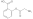

# Creating CxSMILES

This chapter covers the following use case: experiment data has provided
a short list of possible chemical structures, for example, resulting from
a database search on <a name="tp1">molecular formula</a> or <a name="tp2">m/z value</a>. Often, the top hits
of <a name="tp3">posititional isomers</a>, and the wish exists to convert these isomers
into a Markush structure and represented as CxSMILES.

Creating the CxSMILES contains of a few steps:

1. we need to establish the core structure
2. we need to estblish the side chains

## Step 1: the core structure

One step in converting a short list of chemical structures into a CxSMILES
that represents them is determination of the <a name="tp4">maximal common substructure</a>
or <a name="tp5">MCS</a>. The code for this would look like this:

**Script** [code/MCS.groovy](code/MCS.code.md)
```groovy
uiTester = new UniversalIsomorphismTester();
sp = new SmilesParser(
  SilentChemObjectBuilder.getInstance()
)
mol1 = sp.parseSmiles("NCC(=O)OC1=CC=CC=C1C(=O)O")
mol2 = sp.parseSmiles("CCC(=O)OC1=CC=CC=C1C(=O)O")
List<IAtomContainer> list = uiTester.getOverlaps(mol1, mol2);
println "Overlaps: ${list.size()}"
for (ac in list) {
  println "  atom count in overlap: ${ac.atomCount}"
}
```

For the two given input structures, it finds one overlap:

```
Overlaps: 1
  atom count in overlap: 13
```

The resulting MCS can be mapped back to the input structure, and colored
accordingly:

**Script** [code/VisualizeOverlap.groovy](code/VisualizeOverlap.code.md)
```groovy
List<IAtomContainer> list = uiTester.getOverlaps(mol1, mol2);
overlap = list[0]
substructure = mol1.builder.newInstance(IAtomContainer.class)
maplist = uiTester.getSubgraphAtomsMap(mol1, overlap);
for (mapping in maplist) { substructure.addAtom(mol1.getAtom(mapping.id1)) }
new DepictionGenerator()
  .withHighlight(substructure.atoms(), java.awt.Color.lightGray)
  .depict(mol1)
  .writeTo("overlap.svg");
```

We can then see the common structure in the SMILES, here for the first SMILES
from the MCS example:


We can also look at the overlapping bonds instead, and we then use this code:

**Script** [code/VisualizeBondOverlap.groovy](code/VisualizeBondOverlap.code.md)
```groovy
List<IAtomContainer> list = uiTester.getOverlaps(mol1, mol2);
overlap = list[0]
substructure = mol1.builder.newInstance(IAtomContainer.class)
substructureAtoms = new java.util.HashSet<IAtom>()
maplist = uiTester.getSubgraphAtomsMap(mol1, overlap);
for (mapping in maplist) {
  mol1Atom = mol1.getAtom(mapping.id1)
  substructure.addAtom(mol1Atom)
  substructureAtoms.add(mol1Atom)
}
for (bond in mol1.bonds()) {
  allCheckedBondsInSubstructure = true
  for (bondAtom in bond.atoms()) {
    if (substructureAtoms.contains(bondAtom)) {
      allCheckedBondsInSubstructure = false
    } else {
      atLeastOneAtomInSubstructure = true
    }
  }
  if (allCheckedBondsInSubstructure)
    substructure.addBond(bond)
}
```

This gives us:



Finally, we can calculate the SMILES for the core structure. But the for the core
structure, we need not only the overlap, but we also need to know where the bonds
are the connect the core structure connect to side groups. Here we have code that
does this for one of the two SMILES structures:

**Script** [code/CoreStructure.groovy](code/CoreStructure.code.md)
```groovy
substructure = mol1.builder.newInstance(IAtomContainer.class)
substructureAtoms = new java.util.HashSet<IAtom>()
maplist = uiTester.getSubgraphAtomsMap(mol1, overlap);
for (mapping in maplist) {
  mol1Atom = mol1.getAtom(mapping.id1)
  substructureAtoms.add(mol1Atom)
}
for (bond in mol1.bonds()) {
  allCheckedAtomsInSubstructure = true
  for (bondAtom in bond.atoms()) {
    if (substructureAtoms.contains(bondAtom)) {
      atLeastOneAtomInSubstructure = true
    } else {
      allCheckedAtomsInSubstructure = false
    }
  }
  if (allCheckedAtomsInSubstructure) {
    // this is a bond in the substructure
    for (bondAtom in bond.atoms())
      if (!substructure.contains(bondAtom))
        substructure.addAtom(bondAtom)
    substructure.addBond(bond)
  } else if (atLeastOneAtomInSubstructure) {
    // this is an attachment point
  } else {
    // this is a bond in an R group
  }
}
sg = SmilesGenerator.isomeric();
println "core structure:"
println "" + sg.create(substructure)
```

Note how we end up with one uncomplete
carbon in the resulting SMILES:

```
core structure:
[CH2]C(=O)OC1=CC=CC=C1C(=O)O
```

## Step 2: the side chains

Before we go to the attachments, ...

## Step 3: the attachment points

**Script** [code/APs.groovy](code/APs.code.md)
```groovy
List<IAtomContainer> list = uiTester.getOverlaps(mol1, mol2);
overlap = list[0]
substructure = mol1.builder.newInstance(IAtomContainer.class)
substructureAtoms = new java.util.HashSet<IAtom>()
maplist = uiTester.getSubgraphAtomsMap(mol1, overlap);
for (mapping in maplist) {
  mol1Atom = mol1.getAtom(mapping.id1)
  substructureAtoms.add(mol1Atom)
}
for (bond in mol1.bonds()) {
  allCheckedAtomsInSubstructure = true
  for (bondAtom in bond.atoms()) {
    if (substructureAtoms.contains(bondAtom)) {
      atLeastOneAtomInSubstructure = true
    } else {
      allCheckedAtomsInSubstructure = false
    }
  }
  if (allCheckedAtomsInSubstructure) {
    // this is a bond in the substructure
    for (bondAtom in bond.atoms())
      if (!substructure.contains(bondAtom))
        substructure.addAtom(bondAtom)
    substructure.addBond(bond)
  } else if (atLeastOneAtomInSubstructure) {
    // this is an attachment point
  } else {
    // this is a bond in an R group
  }
}
sg = SmilesGenerator.isomeric();
println "core structure:"
println "" + sg.create(substructure)
```


## References


