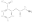

# Creating CxSMILES

This chapter covers the following use case: experiment data has provided
a short list of possible chemical structures, for example, resulting from
a database search on <a name="tp1">molecular formula</a> or <a name="tp2">m/z value</a>. Often, the top hits
of <a name="tp3">posititional isomers</a>, and the wish exists to convert these isomers
into a Markush structure and represented as CxSMILES.

## Maximal Common Substructure

One step in converting a short list of chemical structures into a CxSMILES
that represents them is determination of the <a name="tp4">maximal common substructure</a>
or <a name="tp5">MCS</a>. The code for this would look like this:

**Script** [code/MCS.groovy](code/MCS.code.md)
```groovy
uiTester = new UniversalIsomorphismTester();
sp = new SmilesParser(
  SilentChemObjectBuilder.getInstance()
)
mol1 = sp.parseSmiles("NCC(=O)OC1=CC=CC=C1C(=O)O")
mol2 = sp.parseSmiles("CCC(=O)OC1=CC=CC=C1C(=O)O")
List<IAtomContainer> list = uiTester.getOverlaps(mol1, mol2);
println "Overlaps: ${list.size()}"
for (ac in list) {
  println "  atom count in overlap: ${ac.atomCount}"
}
```

For the two given input structures, it finds one overlap:

```
Overlaps: 1
  atom count in overlap: 13
```

The resulting MCS can be mapped back to the input structure, and colored
accordingly:

**Script** [code/APs.groovy](code/APs.code.md)
```groovy
List<IAtomContainer> list = uiTester.getOverlaps(mol1, mol2);
overlap = list[0]
substructure = mol1.builder.newInstance(IAtomContainer.class)
maplist = uiTester.getSubgraphAtomsMap(mol1, overlap);
for (mapping in maplist) { substructure.addAtom(mol1.getAtom(mapping.id1)) }
new DepictionGenerator()
  .withHighlight(substructure.atoms(), java.awt.Color.lightGray)
  .depict(mol1)
  .writeTo("overlap.svg");
```

We can then see the common structure in the SMILES, here for the first SMILES
from the MCS example:



## SDF in, CxSMILES out


## References


