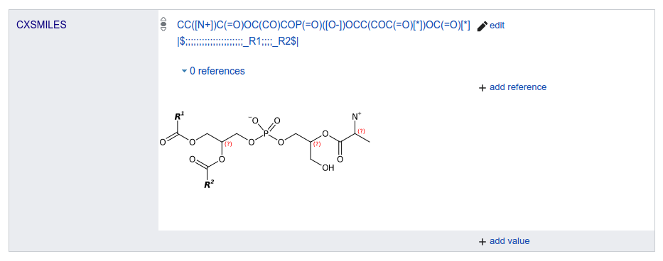

# Introduction

At the Dagstuhl Computation Metabolomics meeting there was a session about core structures.
The research question here is what the right balance is of representation of multiple
structures, matching measured data. [ChemAxon extended SMILES](https://chemaxon.com/marvin-archive/latest/help/formats/cxsmiles-doc.html),
or <a name="tp1">CxSMILES</a>, came up as one solution [<a href="#citeref1">1</a>,<a href="#citeref2">2</a>].
This repository contains code using the <a name="tp2">Chemistry Development Kit</a> [<a href="#citeref3">3</a>,<a href="#citeref4">4</a>,<a href="#citeref5">5</a>]
for various tasks around this question. The following chapters discuss these.

## CxSMILES in Wikidata

Prior to the Computation Metabolomics 2022 meeting a proposal was made to add a Wikidata
property for CxSMILES which was approved during the meeting. This was accepted as
[P10718](https://wikidata.org/entity/P10718). The growth of the use of CXSMILES
can be monitored with [this query](https://query.wikidata.org/embed.html#%23title%3AChart%20of%20P10718%20usage%0A%23%20Note%3A%20this%20chart%20is%20based%20on%20https%3A%2F%2Fwww.wikidata.org%2Fwiki%2FTemplate%3AProperty_uses%0A%23%20which%20is%20updated%20once%20a%20day%20by%20PLbot%0A%0A%23defaultView%3ALineChart%0ASELECT%20%3Fday%20%3Fcount%20WITH%20%7B%20SELECT%20%28%22.%2B%5C%5C%7C10718%3D%28%5C%5Cd%2B%29.%2B%22%20as%20%3Fr%29%20%28%22%7C10718%3D%22%20as%20%3Fp%29%0A%20%20%28IF%28CONTAINS%28%3Fr1%2C%3Fp%29%2Cxsd%3Ainteger%28REPLACE%28%3Fr1%2C%3Fr%2C%22%241%22%2C%22s%22%29%29%2C-1%29%20AS%20%3Fc1%29%20%28xsd%3AdateTime%28%3Ft1%29%20AS%20%3Fd1%29%0A%20%20%28IF%28CONTAINS%28%3Fr2%2C%3Fp%29%2Cxsd%3Ainteger%28REPLACE%28%3Fr2%2C%3Fr%2C%22%241%22%2C%22s%22%29%29%2C-1%29%20AS%20%3Fc2%29%20%28xsd%3AdateTime%28%3Ft2%29%20AS%20%3Fd2%29%0A%20%20%28IF%28CONTAINS%28%3Fr3%2C%3Fp%29%2Cxsd%3Ainteger%28REPLACE%28%3Fr3%2C%3Fr%2C%22%241%22%2C%22s%22%29%29%2C-1%29%20AS%20%3Fc3%29%20%28xsd%3AdateTime%28%3Ft3%29%20AS%20%3Fd3%29%0A%20%20%28IF%28CONTAINS%28%3Fr4%2C%3Fp%29%2Cxsd%3Ainteger%28REPLACE%28%3Fr4%2C%3Fr%2C%22%241%22%2C%22s%22%29%29%2C-1%29%20AS%20%3Fc4%29%20%28xsd%3AdateTime%28%3Ft4%29%20AS%20%3Fd4%29%0A%20%20%28IF%28CONTAINS%28%3Fr5%2C%3Fp%29%2Cxsd%3Ainteger%28REPLACE%28%3Fr5%2C%3Fr%2C%22%241%22%2C%22s%22%29%29%2C-1%29%20AS%20%3Fc5%29%20%28xsd%3AdateTime%28%3Ft5%29%20AS%20%3Fd5%29%0A%20%20%28IF%28CONTAINS%28%3Fr6%2C%3Fp%29%2Cxsd%3Ainteger%28REPLACE%28%3Fr6%2C%3Fr%2C%22%241%22%2C%22s%22%29%29%2C-1%29%20AS%20%3Fc6%29%20%28xsd%3AdateTime%28%3Ft6%29%20AS%20%3Fd6%29%0A%20%20%28IF%28CONTAINS%28%3Fr7%2C%3Fp%29%2Cxsd%3Ainteger%28REPLACE%28%3Fr7%2C%3Fr%2C%22%241%22%2C%22s%22%29%29%2C-1%29%20AS%20%3Fc7%29%20%28xsd%3AdateTime%28%3Ft7%29%20AS%20%3Fd7%29%0A%20%20%28IF%28CONTAINS%28%3Fr8%2C%3Fp%29%2Cxsd%3Ainteger%28REPLACE%28%3Fr8%2C%3Fr%2C%22%241%22%2C%22s%22%29%29%2C-1%29%20AS%20%3Fc8%29%20%28xsd%3AdateTime%28%3Ft8%29%20AS%20%3Fd8%29%0A%20%20%28IF%28CONTAINS%28%3Fr9%2C%3Fp%29%2Cxsd%3Ainteger%28REPLACE%28%3Fr9%2C%3Fr%2C%22%241%22%2C%22s%22%29%29%2C-1%29%20AS%20%3Fc9%29%20%28xsd%3AdateTime%28%3Ft9%29%20AS%20%3Fd9%29%0A%20%20%28IF%28CONTAINS%28%3Fr10%2C%3Fp%29%2Cxsd%3Ainteger%28REPLACE%28%3Fr10%2C%3Fr%2C%22%241%22%2C%22s%22%29%29%2C-1%29%20AS%20%3Fc10%29%20%28xsd%3AdateTime%28%3Ft10%29%20AS%20%3Fd10%29%0A%20%20%7B%20SERVICE%20wikibase%3Amwapi%20%7B%0A%20%20%20%20%20%20bd%3AserviceParam%20wikibase%3Aapi%20%22Generator%22%20%3B%20wikibase%3Aendpoint%20%22www.wikidata.org%22%20%3B%20mwapi%3Agenerator%20%22allpages%22%20%3B%20%0A%20%20%20%20%20%20%20%20%20%20%20%20%20%20%20%20%20%20%20%20%20%20mwapi%3Agapfrom%20%22Property_uses%22%20%3B%20mwapi%3Agapto%20%22Property_uses%22%20%3B%20mwapi%3Agapnamespace%20%2210%22%20%3B%20%0A%20%20%20%20%20%20%20%20%20%20%20%20%20%20%20%20%20%20%20%20%20%20mwapi%3Aprop%20%22revisions%22%20%3B%20mwapi%3Arvprop%20%22content%7Ctimestamp%22%20%3B%20mwapi%3Arvlimit%20%2210%22%20%3B%20mwapi%3Arvuser%20%22PLbot%22%20%3B%20wikibase%3Alimit%20%22100%22%20.%0A%20%20%20%20%20%20%3Ft1%20wikibase%3AapiOutput%20%22revisions%2Frev%5B1%5D%2F%40timestamp%22%20.%20%3Fr1%20wikibase%3AapiOutput%20%22revisions%2Frev%5B1%5D%2Ftext%28%29%22%20.%0A%20%20%20%20%20%20%3Ft2%20wikibase%3AapiOutput%20%22revisions%2Frev%5B2%5D%2F%40timestamp%22%20.%20%3Fr2%20wikibase%3AapiOutput%20%22revisions%2Frev%5B2%5D%2Ftext%28%29%22%20.%0A%20%20%20%20%20%20%3Ft3%20wikibase%3AapiOutput%20%22revisions%2Frev%5B3%5D%2F%40timestamp%22%20.%20%3Fr3%20wikibase%3AapiOutput%20%22revisions%2Frev%5B3%5D%2Ftext%28%29%22%20.%0A%20%20%20%20%20%20%3Ft4%20wikibase%3AapiOutput%20%22revisions%2Frev%5B4%5D%2F%40timestamp%22%20.%20%3Fr4%20wikibase%3AapiOutput%20%22revisions%2Frev%5B4%5D%2Ftext%28%29%22%20.%0A%20%20%20%20%20%20%3Ft5%20wikibase%3AapiOutput%20%22revisions%2Frev%5B5%5D%2F%40timestamp%22%20.%20%3Fr5%20wikibase%3AapiOutput%20%22revisions%2Frev%5B5%5D%2Ftext%28%29%22%20.%0A%20%20%20%20%20%20%3Ft6%20wikibase%3AapiOutput%20%22revisions%2Frev%5B6%5D%2F%40timestamp%22%20.%20%3Fr6%20wikibase%3AapiOutput%20%22revisions%2Frev%5B6%5D%2Ftext%28%29%22%20.%0A%20%20%20%20%20%20%3Ft7%20wikibase%3AapiOutput%20%22revisions%2Frev%5B7%5D%2F%40timestamp%22%20.%20%3Fr7%20wikibase%3AapiOutput%20%22revisions%2Frev%5B7%5D%2Ftext%28%29%22%20.%0A%20%20%20%20%20%20%3Ft8%20wikibase%3AapiOutput%20%22revisions%2Frev%5B8%5D%2F%40timestamp%22%20.%20%3Fr8%20wikibase%3AapiOutput%20%22revisions%2Frev%5B8%5D%2Ftext%28%29%22%20.%0A%20%20%20%20%20%20%3Ft9%20wikibase%3AapiOutput%20%22revisions%2Frev%5B9%5D%2F%40timestamp%22%20.%20%3Fr9%20wikibase%3AapiOutput%20%22revisions%2Frev%5B9%5D%2Ftext%28%29%22%20.%0A%20%20%20%20%20%20%3Ft10%20wikibase%3AapiOutput%20%22revisions%2Frev%5B10%5D%2F%40timestamp%22%20.%20%3Fr10%20wikibase%3AapiOutput%20%22revisions%2Frev%5B10%5D%2Ftext%28%29%22%20.%0A%20%20%20%20%7D%0A%20%20%7D%0A%7D%20as%20%25revs%20%7B%0A%20%20%7BBIND%28%3Fc1%20AS%20%3Fcount%29%20BIND%28%3Fd1%20AS%20%3Fday%29%20INCLUDE%20%25revs%7D%20UNION%0A%20%20%7BBIND%28%3Fc2%20AS%20%3Fcount%29%20BIND%28%3Fd2%20AS%20%3Fday%29%20INCLUDE%20%25revs%7D%20UNION%0A%20%20%7BBIND%28%3Fc3%20AS%20%3Fcount%29%20BIND%28%3Fd3%20AS%20%3Fday%29%20INCLUDE%20%25revs%7D%20UNION%0A%20%20%7BBIND%28%3Fc4%20AS%20%3Fcount%29%20BIND%28%3Fd4%20AS%20%3Fday%29%20INCLUDE%20%25revs%7D%20UNION%0A%20%20%7BBIND%28%3Fc5%20AS%20%3Fcount%29%20BIND%28%3Fd5%20AS%20%3Fday%29%20INCLUDE%20%25revs%7D%20UNION%0A%20%20%7BBIND%28%3Fc6%20AS%20%3Fcount%29%20BIND%28%3Fd6%20AS%20%3Fday%29%20INCLUDE%20%25revs%7D%20UNION%0A%20%20%7BBIND%28%3Fc7%20AS%20%3Fcount%29%20BIND%28%3Fd7%20AS%20%3Fday%29%20INCLUDE%20%25revs%7D%20UNION%0A%20%20%7BBIND%28%3Fc8%20AS%20%3Fcount%29%20BIND%28%3Fd8%20AS%20%3Fday%29%20INCLUDE%20%25revs%7D%20UNION%0A%20%20%7BBIND%28%3Fc9%20AS%20%3Fcount%29%20BIND%28%3Fd9%20AS%20%3Fday%29%20INCLUDE%20%25revs%7D%20UNION%0A%20%20%7BBIND%28%3Fc10%20AS%20%3Fcount%29%20BIND%28%3Fd10%20AS%20%3Fday%29%20INCLUDE%20%25revs%7D%20%0A%20%20FILTER%28%3Fcount%20%21%3D%20-1%29%0A%7D).
At the time of writing, it is mostly [used for polymers and groups of compounds](https://www.wikidata.org/wiki/Wikidata:Database_reports/Constraint_violations/P10718#Types_statistics).
The SPARQL query [https://w.wiki/58rF](https://w.wiki/58rF) returns a list of Wikidata items with a
CxSMILES value.

## CDKDepict Gadget

There is a [CDKDepict Gadget](https://www.wikidata.org/wiki/User:Egon_Willighagen/cdkdepict_gadget.js) available for Wikidata that will change the Wikidata
interface and depict the CXSMILES:

## References

1. Alexandrov T, Böcker S, Dorrestein P, Schymanski E. Computational Metabolomics: Identification, Interpretation, Imaging (Dagstuhl Seminar 17491). 2018.  doi:[10.4230/DAGREP.7.12.1](https://doi.org/10.4230/DAGREP.7.12.1) ([Scholia](https://scholia.toolforge.org/doi/10.4230/DAGREP.7.12.1))
2. Ludwig M, Neumann S, Willighagen E. Cheminformatics for Users. In: Computational Metabolomics: From Cheminformatics to Machine Learning (Dagstuhl Seminar 20051). 2020. 
3. Steinbeck C, Han Y, Kuhn S, Horlacher O, Luttmann E, Luttmann E, et al. The Chemistry Development Kit (CDK): an open-source Java library for Chemo- and Bioinformatics. JCICS. 2003 Feb 11;43(2):493–500.  doi:[10.1021/CI025584Y](https://doi.org/10.1021/CI025584Y) ([Scholia](https://scholia.toolforge.org/doi/10.1021/CI025584Y))
4. Steinbeck C, Hoppe C, Hoppe C, Kuhn S, Floris M, Guha R, et al. Recent Developments of the Chemistry Development Kit (CDK) - An Open-Source Java Library for Chemo- and Bioinformatics. Curr Pharm Des [Internet]. 2006 Jun 1;12(17):2111–20. Available from: https://cdk.github.io/cdk-paper-2/ doi:[10.2174/138161206777585274](https://doi.org/10.2174/138161206777585274) ([Scholia](https://scholia.toolforge.org/doi/10.2174/138161206777585274))
5. Willighagen E, Mayfield JW, Alvarsson J, Berg A, Carlsson L, Jeliazkova N, et al. The Chemistry Development Kit (CDK) v2.0: atom typing, depiction, molecular formulas, and substructure searching. J Cheminform. 2017 Jun 6;9(1).  doi:[10.1186/S13321-017-0220-4](https://doi.org/10.1186/S13321-017-0220-4) ([Scholia](https://scholia.toolforge.org/doi/10.1186/S13321-017-0220-4))

