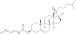

# Liebisch abbreviations

The Liebisch abbrevations are a shorthand notation for lipid structures. This is particularly useful
when the lipid is incompletely characterized [<cite>Q40470345</cite>,<cite>Q100512153</cite>].

For example, we can use the following code to depict `CE 16:1`, using CXSMILES as intermediate step:

<code>DepictLipidAbbrev</code>

The output looks like this:

## References

<references/>

