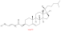
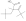

# Liebisch abbreviations

The Liebisch abbrevations are a shorthand notation for lipid structures. This is particularly useful
when the lipid is incompletely characterized [<cite>Q40470345</cite>,<cite>Q100512153</cite>].

## CXSMILES

We can use the following code to depict `CE 16:1`, using CXSMILES as intermediate step:

<code>DepictLipidAbbrev</code>

The output looks like this:

### Some examples

Instead of depicting, we can just output the CXSMILES generated from the shorthand notation:

<code>LiebischExamples</code>

The output looks like this:

<out>LiebischExamples</out>

## Structure enumeration

The abbreviation `FA 14:1` indicates the structure is a fatty acid with an chain with 13 carbon atoms
(and 14 carbons in the compound in total), and with one double bond equivalent. There can be branching
and there can even be rings. For example, this is said to be a valid `FA 14:1`:

<!-- <code>FA14Branching</code> -->

If we take this loose definition, the number of possible structures is high. With Surge we can enumerate
the number of structures

## References

<references/>

