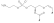
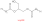
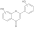

# Classes of compounds and where to find a CxSMILES

## R-groups

A common application of CXSMILES is the use of <topic>R-groups</topic>.
This is done with the following CXSMILES pattern like
`[NH3+]CCOP([O-])(=O)OC[C@@H](CO\C=C/[*])OC([*])=O |$;;;;;;;;;;;;;;R;;;R$|`:

<out>RGroup</out>

## Lipids

### Lipids with a double bond somewhere in the tail

If we have a single tail <topic>lipid</topic> with `x+y+2` carbons in the tail but we do not
know the location of the double bond, we can use a CxSMILES like
`[H]C\\C=C\\CC(=O)O |Sg:n:1:x:ht,Sg:n:4:y:ht| x+y=15`:

<out>TemplateLipidDoubleBond</out>

### Lipids with two double bonds somewhere in the tail

If we have a single tail <topic>lipid</topic> with `x+y+z+4` carbons in the tail but we do not
know the location of the double bonds, we can use a CxSMILES like
`[H]CC=CCC=CCC(=O)O |Sg:n:1:x:ht,Sg:n:4:y:ht,Sg:n:7:z:ht| x+y+z=15`:

<out>TemplateLipidTwoDoubleBonds</out>

### Lipids with two tails

Sometimes experimental data does not provide enough information to decide how long
the individual <topic>lipid tails</topic> are, but only provide the total length. Then a template like
`OCC(OC(=O)C[H])COC(=O)C[H] |Sg:n:6:x:ht,Sg:n:12:y:ht| x+y=28` can be useful:

<out>TemplateLipidTwoTail</out>

## Positional uncertainty

When it is knows that, for example, a ring has a hydrogen replace by another atom
but the exact <topic>position</topic> is not known, CxSMILES allows you to indicate what the possible
locations are. For example, monochlorobiphenyl can be represented with the
CxSMILES `Cl*.c1ccccc1-c1ccccc1 |m:1:3.4.5.6.7.8.9|`:

<out>TemplateMonobiphenyl</out>

### Flavonoid 

Or for a flavonoid with known number of hydroxy groups on each rings, but with position uncertainty:
`O*.O*.C1=C(C(=C2C(=C1)OC(=CC2=O)C3=CC(=C(C=C3)))).O* |m:3:4.5,m:1:8.9,m:22:18.19|`

<out>TemplateFlavonoid</out>

## Polymers

Polymers can be defined as a repeating unit started with `Sg:n:` followed by the
atom indices (starting at 0) of the atoms in the <topic>monomer</topic> unit: `[*]c1Nc(cc1)c1Nc(cc1)[*] |Sg:n:1,2,3,4,5,6,7,8,9,10::ht|`.
This gives this <topic>polymer</topic> template:

<out>TemplatePolymer</out>

