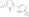

# Classes of compounds and where to find a CxSMILES

## Lipids

### Lipids with a double bond somewhere in the tail

If we have a single tail <topic>lipid</topic> with `x+y+2` carbons in the tail but we do not
know the location of the double bond, we can use a CxSMILES like
`[H]C\\C=C\\CC(=O)O |Sg:n:1:x:ht,Sg:n:4:y:ht| x+y=15`:

<out>TemplateLipidDoubleBond</out>

## Positional uncertainty

When it is knows that, for example, a ring has a hydrogen replace by another atom
but the exact <topic>position</topic> is not known, CxSMILES allows you to indicate what the possible
locations are. For example, monochlorobiphenyl can be represented with the
CxSMILES `Cl*.c1ccccc1-c1ccccc1 |m:1:3.4.5.6.7.8.9|`:

<out>TemplateMonobiphenyl</out>

## Polymers

Polymers can be defined as a repeating unit started with `Sg:n:` followed by the
atom indices (starting at 0) of the atoms in the <topic>monomer</topic> unit: `[*]c1Nc(cc1)c1Nc(cc1)[*] |Sg:n:1,2,3,4,5,6,7,8,9,10::ht|`.
This gives this <topic>polymer</topic> template:

<out>TemplatePolymer</out>

